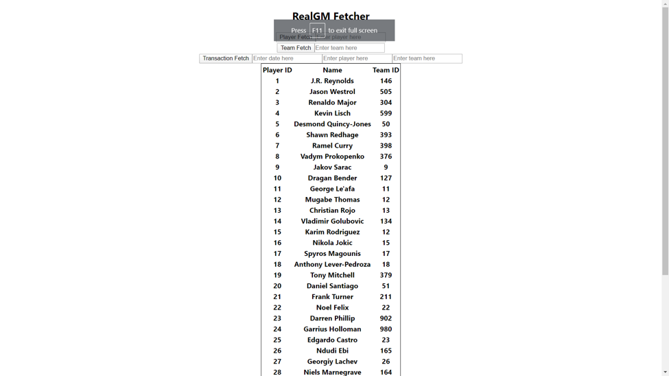

# Introduction
Real GM Fetcher is designed to help individuals find information on basketball transactions outside of the NBA. Unlike NBA contracts, international contract information is harder to find and not as readily publicized. Users can find when players are traded, how frequently teams sign and trade, and gain valuable insights quickly. To obtain the data, I use Python's BeautifulSoup to scrape data from Real GM's international transaction database. React, Python, Flask, and SQL are used in tandem to create a micro full-stack application. Feel free to play with the source yourself and send me any questions you have.

# Requirements
Listed in [requirements.txt](requirements.txt).  
This application uses React.js to render the DOM. Make sure to install React using your JS package manager.

# Files
[realgm.py](src/realgm.py) is used to populate the SQL database.  
[server.py](src/server.py) configures a local Flask server.   
[App.js](src/App.js) calls endpoints and renders the DOM using React components.

# Instructions  
#### Fetch data #### 
This will populate an .sqlite file. Navigate to src and run:  
```bash
python realgm.py
```
#### Configure local server ####
To access the local .sqlite file, I set up a local Flask server. This will provide access points to the sqlite file. Run:   
```bash
python server.py
```
#### Run React ####
Make sure to install Node Package Manager (npm). Node dependencies are purposely excluded from this repository. To install dependencies, Run:  
```bash
npm install
```
To start the React application, Run:  
```bash
npm start
```


